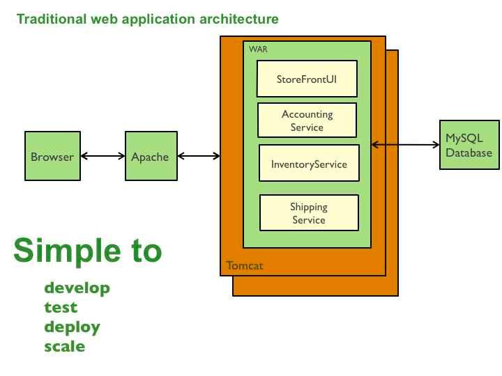
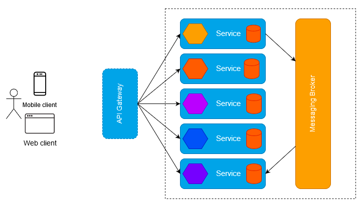
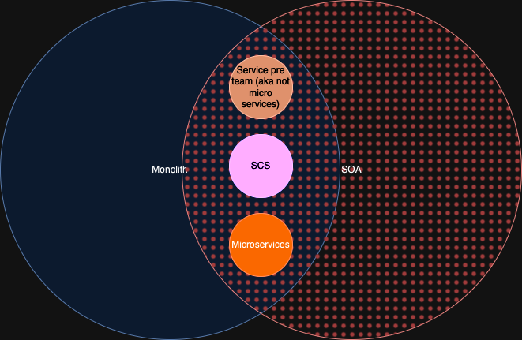
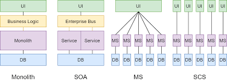
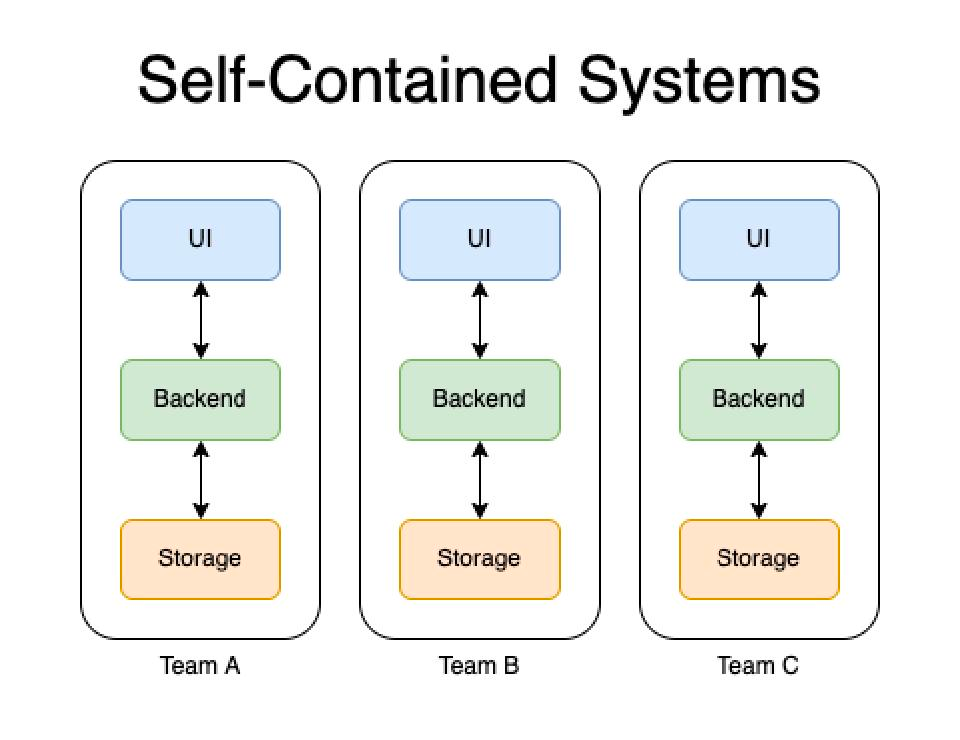
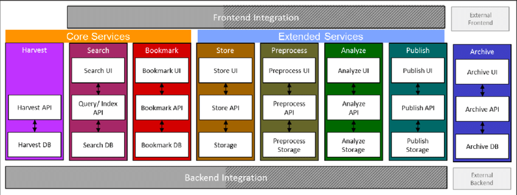
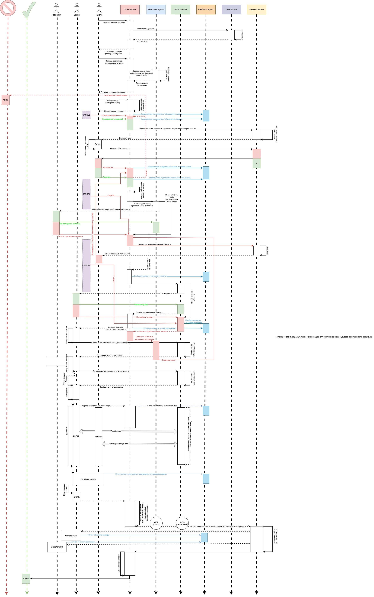

# Self-contained systems

Self-contained systems architecture is the one of much
traditional software development models how to split business logics.

At first, lets look at monolith and microservices as most common code architectures:

## 1. Monolith:

A monolithic architecture is a traditional model of a software program,
which is built as a unified unit that is self-contained and independent
of other applications.
The word “monolith” is often attributed to something
large and glacial, which isn’t far from the truth of a monolith architecture for software design.
A monolithic architecture is a singular, large computing network with one code base that couples
all the business concerns together. To make a change to this sort of application requires updating the entire
stack by accessing the code base and building and deploying an updated version of the service-side interface. This
makes updates restrictive and time-consuming.

Monoliths can be convenient early on in a project's life for ease of code management, cognitive overhead, and
deployment. This allows everything in the monolith to be released at once.  

### Advantages of a monolithic architecture

Organizations can benefit from either a monolithic or microservices architecture, depending on a number of different
factors. When developing using a monolithic architecture, the primary advantage is fast development speed due to the
simplicity of having an application based on one code base.

The advantages of a monolithic architecture include:

* Easy deployment – One executable file or directory makes deployment easier.

* Development – When an application is built with one code base, it is easier to develop.

* Performance – In a centralized code base and repository, one API can often perform the same function that numerous
  APIs
  perform with microservices.

* Simplified testing – Since a monolithic application is a single, centralized unit, end-to-end testing can be
  performed
  faster than with a distributed application.

* Easy debugging – With all code located in one place, it’s easier to follow a request and find an issue.

### Disadvantages of a monolithic architecture

As with the case of Netflix, monolithic applications can be quite effective until they grow too large and scaling
becomes a challenge. Making a small change in a single function requires compiling and testing the entire platform,
which goes against the agile approach today’s developers favor.

The disadvantages of a monolith include:

* Slower development speed – A large, monolithic application makes development more complex and slower.

* Scalability – You can’t scale individual components.

* Reliability – If there’s an error in any module, it could affect the entire application’s availability.

* Barrier to technology adoption – Any changes in the framework or language affects the entire application, making
  changes often expensive and time-consuming.

* Lack of flexibility – A monolith is constrained by the technologies already used in the monolith.

* Deployment – A small change to a monolithic application requires the redeployment of the entire monolith.

## Microservices

A microservices architecture, also simply known as microservices, is an architectural method that relies on a series of
independently deployable services. These services have their own business logic and database with a specific goal.
Updating, testing, deployment, and scaling occur within each service. Microservices decouple major business,
domain-specific concerns into separate, independent code bases. Microservices don’t reduce complexity, but they make any
complexity visible and more manageable by separating tasks into smaller processes that function independently of each
other and contribute to the overall whole.

Adopting microservices often goes hand in hand with DevOps, since they are the basis for continuous delivery practices
that allow teams to adapt quickly to user requirements.

### Advantages of microservices

Microservices are by no means a silver bullet, but they solve a number of problems for growing software and companies.
Since a microservices architecture consists of units that run independently, each service can be developed, updated,
deployed, and scaled without affecting the other services. Software updates can be performed more frequently, with
improved reliability, uptime, and performance. We went from pushing updates once a week, to two to three times a day.

As Atlassian grows, microservices enable us to scale teams and geographic locations more reliably by splitting along
lines of service ownership. Before we started Vertigo, Atlassian had five different development centers around the
world. These distributed teams were constrained by a centralized monolith and we needed to support them in an autonomous
fashion. Microservices allow us to do so.

The benefits of Vertigo include increased deployment speed, disaster recovery, reduced cost, and higher performance.
This allows us to get to our target faster while delivering more incremental value to customers along the way.

Plus, more generally, microservices make it easier for teams to update code and accelerate release cycles with
continuous integration and continuous delivery (CI/CD). Teams can experiment with code and roll back if something goes
wrong.

* In short, the advantages of microservices are:

* Agility – Promote agile ways of working with small teams that deploy frequently.

* Flexible scaling – If a microservice reaches its load capacity, new instances of that service can rapidly be deployed
  to
  the accompanying cluster to help relieve pressure. We are now multi-tenanant and stateless with customers spread
  across
  multiple instances. Now we can support much larger instance sizes.

* Continuous deployment – We now have frequent and faster release cycles. Before we would push out updates once a week
  and
  now we can do so about two to three times a day.

* Highly maintainable and testable – Teams can experiment with new features and roll back if something doesn’t work.
  This
  makes it easier to update code and accelerates time-to-market for new features. Plus, it is easy to isolate and fix
  faults and bugs in individual services.

* Independently deployable – Since microservices are individual units they allow for fast and easy independent
  deployment
  of individual features.

* Technology flexibility – Microservice architectures allow teams the freedom to select the tools they desire.

* High reliability – You can deploy changes for a specific service, without the threat of bringing down the entire
  application.

* Happier teams – The Atlassian teams who work with microservices are a lot happier, since they are more autonomous and
  can build and deploy themselves without waiting weeks for a pull request to be approved.

### Disadvantages of microservices

When we moved from a small number of monolithic codebases to many more distributed systems and services powering our
products, unintended complexity arose. We initially struggled to add new capabilities with the same velocity and
confidence as we had done in the past. Microservices can add increased complexity that leads to development sprawl, or
rapid and unmanaged growth. It can be challenging to determine how different components relate to each other, who owns a
particular software component, or how to avoid interfering with dependent components.

With Vertigo, we built a common functionality that would power our existing products and future products we acquire and
build. If you are a single product company, microservices may not be necessary.

The disadvantages of microservices can include:

* Development sprawl – Microservices add more complexity compared to a monolith architecture, since there are more
  services in more places created by multiple teams. If development sprawl isn’t properly managed, it results in slower
  development speed and poor operational performance.

* Exponential infrastructure costs – Each new microservice can have its own cost for test suite, deployment playbooks,
  hosting infrastructure, monitoring tools, and more.

* Added organizational overhead – Teams need to add another level of communication and collaboration to coordinate
  updates
  and interfaces.

* Debugging challenges – Each microservice has its own set of logs, which makes debugging more complicated. Plus, a
  single
  business process can run across multiple machines, further complicating debugging.

* Lack of standardization – Without a common platform, there can be a proliferation of languages, logging standards, and
  monitoring.

* Lack of clear ownership – As more services are introduced, so are the number of teams running those services. Over
  time
  it becomes difficult to know the available services a team can leverage and who to contact for support.

## Service Oriented Architecture

Service oriented architectures is parent of idea of microservices. Base concept of the architecture is use message
bus (such as message brokers etc).

So, SOA can be used for small and colossal teams both. Example of using small SOA architecture is Node.js frontend
webserver
that communicates with backend server, backend server can be one instance or several instances, written in different
programming
languages.
For big teams, it can be micro-service based backend, feature based services or domain based services:

* Micro-service is common architecture was described below.
* Feature based services is architecture that specifies each service and project by feature. As example we can see K8S
  project.
* Domain based services is microservice, but each service are implemented in different teams. Example UserService will
  store not only user entity
  but also its details and other entities that linked with user.

This list is the most common children architectures.

## Different architectures can be defined by this diagram:

# SOA + Monolith = Self-contained systems

Self-contained systems is several monolith systems that communicate with each other by channels.
This is new architecture been created for modern monolith frameworks like Jmix and Vaadin.

The concept of this architecture is that each service is a monolith, has its own database, its own internal UI and its
own
feature list, which a separate team is working on, there are some common services such as User Management Service, Email
Service, Notification Service and others, as well as each service can be very loosely connected with other services, for
example, the creation of some kind of business process takes place in one system, where it is filled with all the
necessary information and processed, the intermediate result comes to another system and so on, after that, all general
information is distributed to all services that need to know about the business process.

From the description, it can be concluded that this is the same monolith divided into independent or almost independent
smaller monoliths that work with the so-called common project sdk, which includes comprehensive entity data types,
utility functions and a set of common UI components, such as menus and template pages, which can be repeated in all
parts of system.

In some applications, highly loaded places rarely happen, like B2B applications, document management, CRM etc,
and the code that is written is usually strongly
connected by business logic, which is why you have to write thousands of microservices that still need to be deployed,
maintained, manage interactions and solve other problems. Therefore, monoliths in business and document management are
the best solution, and CSS is also a more modern version of the monolith.

#### Common architecture for big project will look like following:

### The advantages of SCS:

* All advantages of monolith architecture
* More efficient small team split
* Much easier support and less code per system
* A little bit easier performance scale issue solving
* Maintain common functionality in small library that contains common UI components, functions, entities and DTOs.
* Can use microservice or microservices inside architecture to improve performance in bottleneck of whole system.
* Best solution for B2B applications, document management, CRM etc.

### The disadvantages of Self Contained Systems:

* Most modern monolith frameworks are not support high-load, if you have colossal team with high-load pages or a lot of
  calculation prefer SOA or microservices.
* It still monolithic architecture, if the codebase will resemble Google or Amazon, it is better to use a different
  approach
* As well as advantages, disadvantages is need to create "common" team that will implement all common things, discuss
  shared UI style and design, feature common business logic.
* If your application will be very complex and connected, use one monolith instead of Self Contained Systems.

## Conclusion

SCS is best used when you do not have a highly loaded system with a large number of features, business logic and
functions, while it can be divided into several different monolithic systems that do not depend or almost do not depend
on each other, are standalone applications, and systems treat each other only as integration, without which they will
work the same way, but may not have some small functionality.

# Variants for SCS demo project:
1. Document management system (DMS)
2. Pet clinic + documentation
3. Code space
4. Food delivery business

## Document management system, probable features
1. (For users) Document direct processing system, including EDS, business processes
2. (For managers) Document management, import, export, scanning, etc
3. (For admins) Document's linked entity glossary (Enum/etc management)
4. (For system) User management system
5. ?

#### Advantages:
* The closest topic to customers
* Having local haulmont examples

#### Disadvantages:
* Complex
* Boring
* Need EDS or placeholders for EDS system

## Pet clinic
1. Client based pet clinic (Make an appointment with a doctor, buy meds, etc)
2. Medic based pet clinic (View pets, history of pets, View medication, request for meds, etc)
3. Management based clinic (View employees, billing etc )
4. User management system

#### Advantages:
* Simple 
* Continue previous project
* Entertaining project

#### Disadvantages:
* Topic far from target customers
* Too simple, will not show advantage of SCS

## Code space
1. Repository management system (Git repositories crud)
2. CI/CD system
3. Documentation system
4. Bug tracker / Issue tracking system
5. Dev cloud ?
6. User management system

#### Advantages:
* Most complex
* Closest topic for all programmes
* Fun project

#### Disadvantages:
* Most complex
* Topic far from target customers

## Food delivery business
1. Client order system
2. Restaurant (cooking) system
3. Courier delivery system
4. Payment system
5. User management system

#### Advantages:
* The topic is entirely about business processes
* Easy to implement
* Fun project

#### Disadvantages:
* Most complex
* Too simple, will not show advantage of SCS
* Perhaps it will not be so interesting for target customers

# Food Delivery Project:

First of all, lets think about architecture.
Out SCS project will be separated into several logical modules:
* Order System - all authorized users can order any food from restaurants(all authorized roles are permitted).
* Restaurant System - all authorized users have access only for registration (register own restaurant), if user belongs to
restaurant, he can accept cook food requests and mark it as done for delivery. Also, he can create menus and menu items(food).
* Delivery System - all authorized users have access only for registration (register self as courier). As courier,
user can choose or not delivery requests and do delivery job.
* User System - shared system for all subsystems of project for user management. Shared users, user roles and details, nothing interesting.
* Payment System - shared system for request payment, payment for work, refunds and other, also containing history of payments.
* Notifications System - common system for all subsystems to provide unified notification process (mobile, email, push, etc).
* Shared Library Subsystem - library for all systems, that contains all ui shared components, styles, fonts; common business function,
common internal libraries(superstructures over the frameworks), common JPA entities, DTOs, etc.

## Data Model

## User(Client) Food Delivery Flow:

